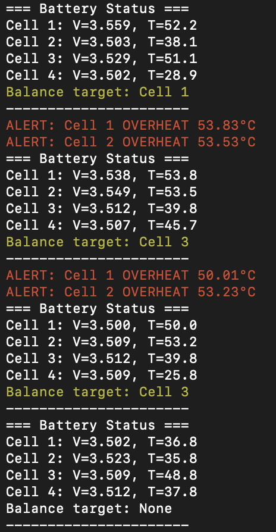

# Embedded BMS Simulation in C

This project simulates a **Battery Management System (BMS)** on an embedded Linux-like environment using **C** and **POSIX threads (pthreads)**. It demonstrates key embedded concepts such as **multi-threading, thread priority, mutex synchronization, and pre-emptive scheduling**.

## Features

* Simulates **4 battery cells** with voltage and temperature readings.
* **Balance thread** checks battery voltages and identifies a cell that needs balancing.
* **Alert thread** monitors temperature and triggers LED indicators if a cell overheats.
* **Logger thread** prints the current state of all cells, LED statuses, and balance target to the console.
* **Thread priorities** are set to mimic real-time scheduling:

  * Battery monitoring threads: priority 30
  * Alert thread: priority 60
  * Balance thread: priority 80
  * Logger thread: lowest priority for periodic output
* **Simulation mode** generates random voltages and temperatures for testing.
* Ready for extension to **real hardware** with ADC and I2C interfaces.

## Project Structure

```
embedded_demo/
├── src/
│   ├── main.c          # Main entry point, thread creation & scheduling
│   ├── battery.c       # Battery monitoring thread
│   ├── balance.c       # Balance checking thread
│   ├── alert.c         # Alert monitoring thread
│   ├── led.c           # LED control
│   ├── logger.c        # Logger thread for centralized console output
├── include/
│   ├── battery.h
│   ├── balance.h
│   ├── alert.h
│   ├── led.h
│   ├── logger.h
│   ├── config.h        # Configuration macros (NUM_CELLS, thresholds)
├── Makefile
└── README.md
```

## Compilation

Make sure you are in the project root directory:

```bash
make clean
make
```

This will produce the executable:

```bash
./embedded_demo
```

## Usage

Run the program in a Linux terminal or container environment:

```bash
./embedded_demo
```

You will see console output showing:

* Battery voltages and temperatures
* Overheat alerts (printed in red)
* Balance targets (printed in yellow)
* LED states

Thread priorities ensure that:

* **Balance thread** executes first if CPU is contended
* **Alert thread** pre-empts battery threads if necessary
* **Logger thread** runs at low priority, only printing output periodically




## Embedded Concepts Demonstrated

* **Memory allocation:** dynamically allocate battery array with `malloc`.
* **Thread priority & preemption:** `pthread_setschedparam()` with `SCHED_FIFO`.
* **Synchronization:** `pthread_mutex_lock()` / `pthread_mutex_unlock()`.
* **Periodic execution:** `sleep()` used for timing control.

## Notes

* All thread-safe access to shared data uses **mutexes** to prevent race conditions.
* **Simulation mode** is enabled via `#define SIMULATION 1` in `battery.h`. To use real sensors, implement the HAL functions `adc_read_voltage()` and `i2c_read_temperature()`.
* Console colors are added for easy visibility of alerts and balance targets.
